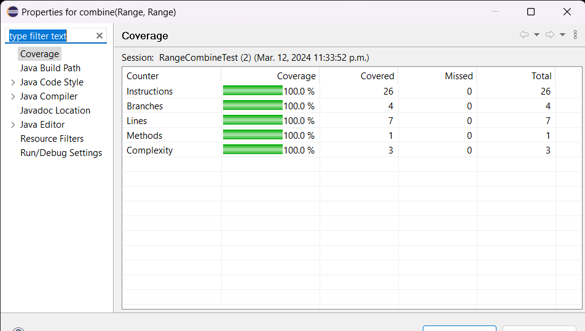
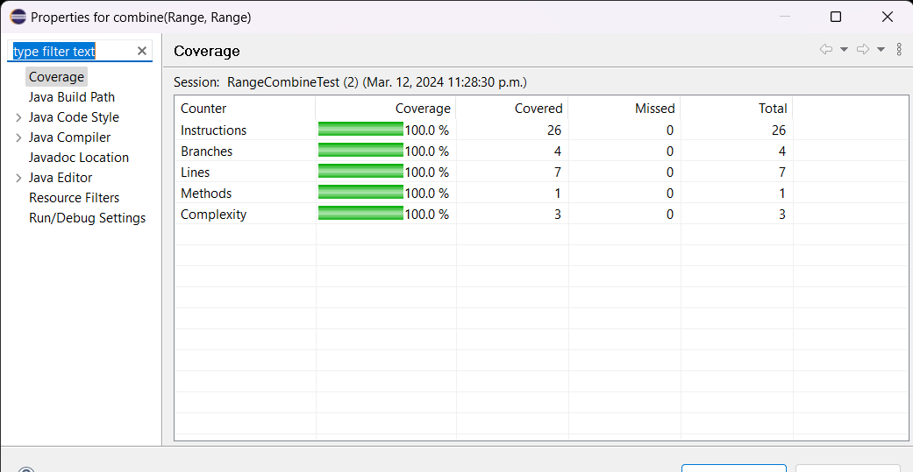
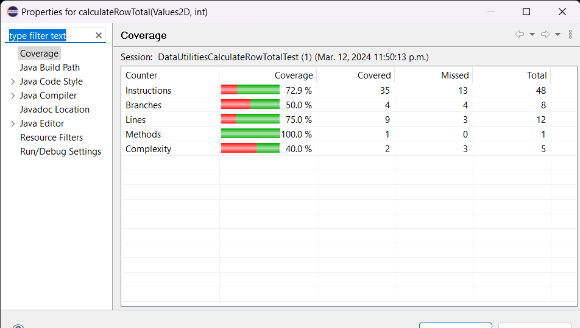
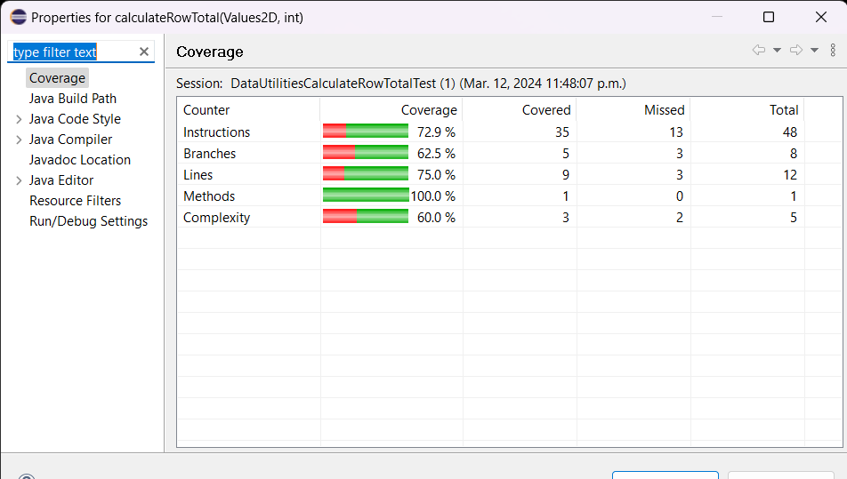

**SENG 637 - Dependability and Reliability of Software Systems**

**Lab. Report #3 – Code Coverage, Adequacy Criteria and Test Case Correlation**

| Group: 4      |
|-----------------|
| Student 1 Arpita Chowdhury                |   
| Student 2 Fadila Abdulai Hamid             |   
| Student 3 Kumkum Akter             |   
| Student 4 Niloofar Sharifisadr              |
| Student 5 Pratishtha Pratishtha |  

**Table of Contents**

[1 Introduction	](#intro)

[2 Manual data-flow coverage calculations for X and Y methods](#man)

[3 A detailed description of the testing strategy for the new unit test](#testst)

[4 A high level description of five selected test cases you have designed using coverage information, and how they have increased code coverage](#hld)

[5 A detailed report of the coverage achieved of each class and method (a screen shot from the code cover results in green and red color would suffice)](#det)

[6 Pros and Cons of coverage tools used and Metrics you report](#pcon)

[7 A comparison on the advantages and disadvantages of requirements-based test generation and coverage-based test generation.](#diffe)

[8 A discussion on how the team work/effort was divided and managed](#team)

[9 Any difficulties encountered, challenges overcome, and lessons learned from performing the lab](#diff)

[10 Comments/feedback on the lab itself](#comm)

# 1 Introduction 

Software testing is a crucial part of the software development process, which aims to make sure of the reliability, correctness, and robustness of software systems. In this assignment, we focused on unit testing, specifically using JUnit, a popular testing framework in the Java ecosystem, like we have done in the previous assignments as well. Through this assignment, we delved into the principles of testing, with primary  emphasis on **white-box coverage criteria**, to determine the adequacy of a test suite based on its test coverage of the underlying codebase.

Our goal in this assignment and this following report is to write new test cases and utilize the test cases from the previous assignment to meet a predetermined code coverage. The `JFreeChart` package, which allows us to create charts in various ways, is the **system under test (SUT)**. It is an open-source Java framework available for free that calculates, creates, and displays charts. Numerous chart types are supported by this framework, such as histograms, pie charts, bar charts, line charts, and several others. The percentage of the source code that is covered while the test suite executes is the code coverage. JFreeChart makes it easy for developers to display professional charts in their applications. In Project 2, we created black-box test cases for ten distinct JFreeChart methods; five of them from the `Range class` and the other five from the `DataUtilities class`. 

Code coverage tools play a vital role for white box analysis by providing insights into the extent to which the code is exercised or covered by the test suite we design. Various coverage metrics, such as statement, branch, and condition coverages, aid in assessing the comprehensiveness of testing efforts to cover all aspects of the codebase. Additionally, we explored data-flow coverage criteria, such as DU pairs coverage, to deepen their understanding of how coverage tools work. In this assignment, we employ these test cases and test for their code coverage. We hope to achieve a minimum of 
  - 90% statement coverage.
  - 70% branch coverage.
  - 60%  method coverage, initially or after adding new testcases.

In this report, throughout all sections, we will provide a detailed account of our testing strategy, including the selection of coverage metrics, the tools used for measuring coverage, and the challenges encountered during the testing process. We will discuss the advantages and limitations of different coverage tools, reflecting on their integration with IDEs, user-friendliness, and effectiveness in identifying gaps in test coverage apart from manual data flow coverage.

# 2 Manual data-flow coverage calculations for X and Y methods 

## CalculateColumnTotal

**Data flow**

**Def-Use Table**

Given the source code for `calculateColumnTotal` and the outlined test cases, we identify the key variables (data, column, total, rowCount, r, n) and their points of definition and use. We construct the table as follows:

| Variable | Defined at Node | dcu (Definition-Clear Use) | dpu (Definition-Predicate Use) |
|----------|-----------------|----------------------------|--------------------------------|
| data     | 1               | {5, 9}                     |                                |
| column   | 1               | {5,9}                        |                                |
| total    | 2               | {7, 11, 12}                     |                                |
| total    | 7               | {7, 11, 12}                     |                                |
| rowCount | 3               |                            | {(4, 5), (4, 8), (8,12) , (8,9)}               |
| n        | 9               | {7,11}                        | {(10,8), (10, 11)}               |
| n        | 5               | {7,11}                     |  {(6,4) , (6,7)}                              |

The DUs that are covered by out test cases are: 

| #   | Test Case                                 | Path                                      |
|-----|-------------------------------------------|-------------------------------------------|
| 1   | calculateColumnTotalForTwoValues          | [1, 2, 3, 4, 5, 6, 7, 8, 9, 10, 11]       |
| 2   | CalculateColumnTotal_nullDataObjectPassed | [1, Exception]                          |
| 3   | CalculateColumnTotal_invalidDataPassed | [1, 2, 3, 4, 5, 6, 7, 8, 9]                |
| 4   | CalculateColumnTotal_columnIsLastColumnInTable | [1, 2, 3, 4, 5, 6, 7, 8, 9, 10, 11]    |
| 5   | CalculateColumnTotal_columnIsFirstInTable | [1, 2, 3, 4, 5, 6, 7, 8, 9, 10, 11]       |
| 6   | CalculateColumnTotal_columnIsNegativeOne | [1, 2, 3, 4, 5, 9, 11]                    |
| 7   | CalculateColumnTotal_columnIsOneMoreThanMax | [1, 2, 3, 4, 5, 9, 11]                  |
| 8   | CalculateColumnTotal_columnIsCentralInTable | [1, 2, 3, 4, 5, 6, 7, 8, 9, 10, 11]     |
| 9   | calculateColumnTotalWithNullValues         | [1, 2, 3, 4, 5, 6, 7, 8, 9, 10, 11]       |
| 10  | calculateColumnTotalForEmptyDataSet        | [1, 2, 3, 4, 11]                          |
| 11  | calculateColumnTotalForInvalidColumnIndex  | [1, 2, 3, 4, 5, Exception]                |

###  All-Uses Coverage (AUC)
All-Uses Coverage involves ensuring that for every definition of a variable, each possible use is executed at least once across the test suite.

To calculate AUC, we need the total count of uses (both dcu and dpu) and how many of them are covered by the test cases.

Given the provided dcu and dpu:

- Total dcu = 13 (from all unique dcu entries in your table).
- Total dpu = 7 (from all unique dpu entries).

If all these uses are covered by your tests, AUC would be calculated as follows:

$AUC = (CU_c + PU_c)/(CU + PU - CU_f - PU_f)$

Since all dcu and dpu are covered, $AUC = (13 + 7)/(13 + 7) = 100%$.

### All-Defs Coverage (ADC)

All-Defs Coverage is concerned with ensuring that for every variable definition in the program, there is at least one test case that uses this definition before it gets redefined or the method exits.

Given our Def-Use Table, the ADC calculation is straightforward as we only need to check if every definition has at least one use (either dcu or dpu).

- `data` is defined at node 1 and used at nodes {5, 9}.
- `column` is defined at node 1 and used at nodes {5, 9}.
- `total` has definitions at nodes 2 and 7, both with uses at {7, 11, 12}.
- `rowCount` is defined at node 3 and has predicate uses.
- `n` has definitions at nodes 9 and 5, with uses detailed accordingly.

Since each definition has at least one use, **ADC = 100%**.

## Range.Intersects

**Data flow**

**Defs, uses, and du-pairs**

| defs: | def(1) = {b0, b1} |
|-------|-------------------|
| uses: | use(2) = {b0, this.lower} |
|       | use(3) = {b1, this.lower} |
|       | use(5) = {b0, this.upper} |
|       | use(6) = {b0, b1} |
| du-pairs: | for b0: (1, 2), (1, 5), (1, 6) |
|           | for b1: (1, 3), (1, 6) |

*DU-pair coverage calculation per test case*

| Variable | Def at node (n) | dcu(v, n) | dpu(v, n) | 
| -------- | --------------- | --------- | --------- | 
| b0       | 1               | {}        | {(2, 3), (2, 5), (5, 6), (5, 7), (6, 4), (6, 7)} | 
| b1       | 1               | {}        | {(3, 4), (3, 7), (6, 4), (6, 7)} | 
|          | Total           | CU = 0    | PU = 10   | 

| Test case | Execution path | DU-pairs covered | CUc + PUc | All-uses coverage % | 
| --------- | -------------- | ---------------- | --------- | -------------------- | 
| intersectsWithInputBLBAndLB | [1, 2, 3, 7] | (1, 2), (1, 3) | (2, 3), (3, 7) | 20% | 
| intersectsWithInputBLBAndALB | [1, 2, 3, 4] | (1, 2), (1, 3) | (2, 3), (3, 4) | 20% | 
| intersectsWithInputBLBAndAUB | [1, 2, 3, 4] | (1, 2), (1, 3) | (2, 3), (3, 4) | 20% | 
| intersectsWithInputLBAndALB | [1, 2, 3, 4] | (1, 2), (1, 3) | (2, 3), (3, 4) | 20% | 
| intersectsWithInputLBAndUB | [1, 2, 3, 4] | (1, 2), (1, 3) | (2, 3), (3, 4) | 20% | 
| intersectsWithInputNOMAndNOM | [1, 2, 5, 6, 4] | (1, 2), (1, 5), (1, 6) | (2, 5), (5, 6), (6, 4), (6, 4) | 40% | 
| intersectsWithInputBUBAndUB | [1, 2, 5, 6, 4] | (1, 2), (1, 5), (1, 6) | (2, 5), (5, 6), (6, 4), (6, 4) | 40% | 
| intersectsWithInputUBAndAUB | [1, 2, 5, 7] | (1, 2), (1, 5) | (2, 5), (5, 7) | 20% | 
| intersectsWithInputMINAndAUB | [1, 2, 5, 6, 4] | (1, 2), (1, 5), (1, 6) | (2, 5), (5, 6), (6, 4), (6, 4) | 40% | 
| intersectsWithInputBLBAndMAX | [1, 2, 3, 4] | (1, 2), (1, 3) | (2, 3), (3, 4) | 20% | 
| intersectsWithInput0And0 | [1, 2, 5, 6, 4] | (1, 2), (1, 5), (1, 6) | (2, 5), (5, 6), (6, 4), (6, 4) | 40% | 
| intersectsWithInputNaNAnd1 | [1, 2, 5, 7] | (1, 2), (1, 5) | (2, 5), (5, 7) | 20% |

Total

CUc + PUc = 8

CU + PU = 10

All-uses coverage = 80%

# 3 A detailed description of the testing strategy for the new unit test 

For this assignment, we have done white-box analysis for the given SUT: `JFreeChart1.0.19` for five methods of two classes: 

`org.jfree.data.DataUtilities` : calculateColumnTotal, calculateRowTotal, getCumulativePercentages, createNumberArray, createNumberArray2D and,
`org.jfree.data.Range` : intersects, combine, expandToInclude, contains, getCentralValue

In order to perform white-box analysis, we follow:

**1. Code Coverage Analysis:** Code coverage analysis will be performed using tool- EclEmma to measure the effectiveness of the test suite in covering the code. The goal is to achieve minimum coverage thresholds defined in the assignment requirements (e.g., 90% statement coverage, 70% branch coverage, 60% condition coverage), which for this tool are line, branch and method coverages.

**2. Refinement and Iteration:** Based on the code coverage analysis and test results, the test suite will be refined and iterated upon to enhance coverage and effectiveness, which will be done by first going through the source code of the methods to analyze which code is not covered. Additional test cases may be added, and existing test cases may be modified to improve coverage and address any gaps identified during testing.

**3. Documentation and Reporting:** Finally, we will document everything by documenting the testing strategy, test cases, test results, code coverage analysis, and any issues or observations encountered during testing. This documentation is added in this report in the following sections.

# 4 A high level description of five selected test cases you have designed using coverage information, and how they have increased code coverage 

**Range.Contains method**

We enhanced `range.contains()` method, with the addition of three test cases. This strategic inclusion aimed at addressing boundary conditions and the handling of `NaN` values, which propelled our code coverage from 75% to 87.5%. Here's a concise overview of the improvements:

- **`testContains_BoundaryValueLower_ReturnsTrue`** ensures the lower boundary of a range (1.0 to 10.0) is correctly identified as being within the range. This test validates the accurate behavior of `contains()` when assessing the lowest limit, affirming that the method rightly includes the lower boundary value.

- **`testContains_BoundaryValueUpper_ReturnsTrue`** checks that the upper boundary of a range (1.0 to 10.0) is considered part of the range. Through this, we verify the `contains()` function's capability to recognize the upper limit as within bounds, reinforcing its reliability in edge-case evaluations.

- **`testContains_NaNValue`** examines the `contains()` method's response to `NaN` values by testing with a range from 1.0 to 10.0. This case confirms that `NaN` values are appropriately handled as external to any numeric range, showcasing the method's robustness against non-numeric inputs.

These additions significantly contribute to the thoroughness of our testing strategy, ensuring the `Range` class's `contains()` method operates reliably across standard, boundary, and exceptional value scenarios.

**DataUtilities.CalculateColoumnTotal method**

The test case additions targeted specific scenarios involving null values, empty data sets, and invalid column indices. As a result, our test coverage experienced a significant boost, reaching 62.5%. Below is a detailed breakdown of the newly integrated tests:

- **`calculateColumnTotalWithNullValues`** effectively demonstrates the method's capability to handle null values within the dataset. By mocking a `Values2D` object to return a mix of numeric values and a null, this test asserts that `calculateColumnTotal` correctly sums up the available numeric values, ignoring nulls, thereby ensuring robustness in real-world data scenarios.

- **`calculateColumnTotalForEmptyDataSet`** addresses the method's behavior when faced with an empty dataset. The setup involves a `Values2D` object configured to represent a dataset with zero rows. The outcome of this test confirms that the method returns a total of 0.0, which aligns with expected functionality, thus validating the method's handling of empty datasets.

- **`calculateColumnTotalForInvalidColumnIndex`** explores the method's response to an invalid column index. By setting up a scenario where the provided column index is beyond the dataset's bounds and expecting an `IndexOutOfBoundsException`, this test ensures that the method adequately safeguards against improper index values, enhancing error handling and security within the `DataUtilities` class

**Range.ExpandToinclude**

Before adding test cases RangeTest.expandToInclude(), the coverage calculated using EclEmma was:
| Counter | Coverage |
|----------|---------|
| Instructions/ Statement |	83.5% |
| Method/ Conditions | 100% |

The minimum requirement of condition coverage was already met, however, 90% of statement coverage was not met.

When we analysed our test code coverage using EclEmma, we found that one branch was not covered and We have found that the branch that we did not cover is when range is null. So we removed that test case and added new test case. 
Range.expandToInclude(null, 10));
Replacing null with value 10.
To improve on the coverage, we have added test cases RangeTest.expandToInclude().

With the addition of new test cases, all metrics have coverage of 100%, as again calculated using EclEmma.
| Counter | Coverage |
|----------|---------|
| Instructions/ Statement |	100% |
| Method/ Conditions | 100% |

**Range.RangeIntersectsTest**

Before adding test case Range.intersectsWithReverse(), the coverage calculated using EclEmma was as mentioned in the below table.
| Counter    | Coverage   |
| -------------- | ------- |
| Statement | 100 %  |
| Branches   |   87.5 %  |
| Lines  |   100 %  |
| Methods   | 100 %|    
| Complexity   |   80 %  |

Although we have reached the minimum coverage of 70% coverage for the branch, we can still find ways to improve this coverage.

When we analyzed our test code coverage using EclEmma, we found that the following condition is only partially covered for the intersects() method in Range class.

public boolean intersects(double b0, double b1) {
        
        if (b0 <= this.lower) {
            return (b1 > this.lower);
        }
        else {
            return (b0 < this.upper && b1 >= b0);
        }
    }

We have found that the branch that we did not cover is when b0 > b1.

To improve on the coverage, we have added the test case intersectsWithReverse() where we called the intersects method with the values -6, -9 respectively so that b0 (-6) is greater than b1 (-9).

With the addition of this test case, all metrics have coverage of 100%, as again calculated using EclEmma.

After adding test case Range.intersectsWithReverse(), the coverage calculated using EclEmma was as mentioned in the below table.
| Counter    | Coverage   |
| -------------- | ------- |
| Statement | 100 %  |
| Branches   | 100 %  |
| Lines  |   100 %  |
| Methods   | 100 %|    
| Complexity   |   80 %  |

So now, branch coverage reached maximum coverage by our  Range.intersectsWithReverse() test case.

# 5 A detailed report of the coverage achieved of each class and method (a screen shot from the code cover results in green and red color would suffice) 

## Range.Combine before

## Range.Combine after

## Range.Contains before

## Range.Contains after

## DataUtilities.CalculateColoumnTotal before

## DataUtilities.CalculateColoumnTotal after

## DataUtilities.CalculateRowTotal before

## DataUtilities.CalculateRowTotal after

## Range.ExpandToinclude Before

## Range.ExpandToinclude After Coverage: Statement

## Range.ExpandToinclude After Coverage: Condition

## Range.Intersects before coverage

### Range.Intersects before coverage: Statement 

### Range.Intersects before coverage: Branch 

### Range.Intersects before coverage: Method

## Range.Intersects after coverage:

### Range.Intersects after coverage: Statement

### Range.Intersects after coverage: Branch

### Range.Intersects after coverage: Method

# 6 Pros and Cons of coverage tools used and Metrics you report 

For this assignment, we have used `Eclemma` as our coverage tool, as it is already integrated in Eclipse and thus is easily accessible.

## Advantages of EclEmma:

**Seamless Integration with Eclipse:** EclEmma's integration with the Eclipse IDE is seamless and thus we get to work with a familiar environment for code coverage analysis eliminating the need for external tools.

**Intuitive User Interface:** The UI is easily understandableand so, one can get clear and easy-to-understand coverage results, enhancing productivity and easy learning.

**Visual Code Highlighting:** EclEmma highlights code directly within the Eclipse editor in the coverage tab or by accessing properties of specific methods, making it visually evident which lines are covered by tests and which are not, facilitating quick identification of untested code segments.

**Diverse Coverage Metrics:** Supporting a range of coverage metrics, including branch, line and method coverage, and so one can select the most relevant metrics for assessing their test suites.

**Comprehensive Reporting:** EclEmma generates comprehensive coverage reports, offering detailed insights into the extent of test coverage across the codebase. These reports aid in identifying areas requiring additional testing efforts. Though even summary wise, properties' covergae tab is helpful.

## Limitations of EclEmma:

**Compatibility Challenges:** One may have to deal with compatibility issues with specific versions of Eclipse or other plugins, potentially leading to conflicts or unstable development environment.

**Performance Overhead:** Instrumenting code for coverage analysis may introduce performance overhead, particularly in large or complex codebases, impacting the efficiency of the testing process.

**Limited Metric Support:** EclEmma may lack support for specific advanced coverage metrics, such as data flow coverage, limiting its suitability for comprehensive test coverage analysis in specific scenarios.

**IDE Dependency:** As EclEmma is tightly coupled with Eclipse, developers using other IDEs may not fully leverage its features, restricting its adoption among a broader software developers community.

**Missing Advanced Features:** Compared to standalone coverage tools, EclEmma needs more advanced features and customization options, constraining its flexibility for specialized testing requirements, beyond the ones covered, so one doesn't need to use other tools at all when dealing with Eclipse.

In terms of the types of coverage that `Eclemma` provides, we mostly focused on Method, line and branch coverage. 

## **Pros and Cons of EclEmma's Method, Line, and Branch Coverage:**

### **Method Coverage:**

**Pros:**

**High-Level View:** Provides a broad overview of tested methods, aiding in identifying untested areas efficiently.

**Simplicity:** Easy to understand and implement, suitable for quick assessments of test suite effectiveness, and generalize what code part is not covered entirely.

**Focus on Core Functionality:** Prioritizes testing of main functions within the codebase.

**Cons:**

**Limited Granularity:** Doesn't differentiate between different execution paths within methods or branches.

**Inadequate for Complex Methods:** execution scenarios in complex methods may not always be analyzed.

### **Line Coverage:**

**Pros:**

**Minute Insights:** Offers detailed insights into tested code lines, facilitating pinpointing areas or lines that need to be further tested.

**Accurate Assessment:** More accurate and specific assessment of test suite effectiveness in comparison to method coverage.

**Detection of Dead Code:** Helps detect and eliminate redundant or unreachable code segments.

**Cons:**

**Overemphasis on Syntax:** sometimes prioritize syntax coverage over functional behavior.

**Complexity Overhead:**  high line coverage may lead to increase in testing effort and maintenance burden.

### **Branch Coverage:**

**Pros:**

**Path Exploration:** Explores different execution paths within conditional statements, ensuring comprehensive testing of all branches.

**Detection of Missing Conditions:** Identifies gaps in test coverage within different conditional statements.

**Enhanced Quality Assurance:**  likelihood of overlooking critical decision points or logic errors is lowered.

**Cons:**

**Complexity Management:** Testing intricate branching structures may require extensive effort and knowledge for the same.

**False Sense of Completeness:** Does not guarantee exhaustive testing within branches, and thus can have incomplete coverage.

# 7 A comparison on the advantages and disadvantages of requirements-based test generation and coverage-based test generation. 

### Requirements-based test generation

#### Advantages
- More representative of actual use cases for a user who would read Javadoc
- Test cases are not biased by looking at the code
- More aligned with user expectations by focusing on requirements and use cases, the tests are likely to cover scenarios that are relevant to the end user, improving the quality of the software.

#### Disadvantages
- No way to verify test coverage
- Planning must be more thorough to ensure all cases are tested
- Test cases may test the same paths multiple times as testers are unsure of the source code
- Planning tests solely based on requirements requires thorough analysis and understanding of the requirements, which can be time-consuming and challenging.

### Coverage-based test generation

#### Advantages
- Can maximize coverage by designing test cases around the methods
- Can verify previous black box tests
- Can ensure test are not all testing the same cases/conditions/methods/paths
- Provides quantitative measure of test coverage: Coverage-based testing allows for the measurement of how much of the codebase is exercised by the tests, providing a clear metric for assessing the quality of testing.
- Helps identify untested code paths: By focusing on achieving high coverage, it can reveal areas of the codebase that are not exercised by tests, prompting further testing efforts.

#### Disadvantages
- Test cases can be biased by looking at the code
- Test cases designed only around coverage may not test all boundary cases, eg incorrect code may pass with normal values but fail at boundaries even with 100% coverage
- Reliance on coverage tools which offer different features
- Testers may unintentionally design tests that align with the structure of the code, potentially missing important requirements or user perspectives.
- can depend on coverage tools. The effectiveness of coverage-based testing relies on the capabilities and accuracy of coverage analysis tools, which may vary in their features and reliability.

# 8 A discussion on how the team work/effort was divided and managed 

Each of the five members extended their work from assignment 2 where each one of us had written test cases for one method of the `Range class` and one method of the `DataUtilities class` that involved using jMock. We first used `Eclemma` to do test coverage(line, method, and branch coverage) for the test cases from assignment 2. After that, we developed more test cases to improve the different test coverages to meet the minimum value requirements and if they were already met by assignment 2 test cases, we wrote more test cases to improve ourselves at Software Testing. Group peer review was done after the individual testing to ensure that the quality of work abides by the scope of the test plan and for a fresh perspective on the designed test cases. The below table summarizes the distribution of development of test cases.

| API Range Method                                      | Tester                | 
| ----------------------------------------------- | --------------------- |
| Range.intersects(double, double)               | Arpita Chowdhury      |
| Range.getCentralValue()      | Fadila Abdulai Hamid |
| Range.expandtoinclude(Range range, double value)| Kumkum Akter          |
| Range.contains(double value)                         | Niloofar Sharifisadr  |
| Range.combine(Range range1, Range range2)      | Pratishtha Pratishtha |

| API DataUtilities Method                                      | Tester                | 
| ----------------------------------------------- | --------------------- |
| DataUtilities.createNumberArray(double[] data)               | Arpita Chowdhury      |
| DataUtilities.getCumulativePercentages(keyedValues data)      | Fadila Abdulai Hamid |
| DataUtilities.createNumberArray2D(double[] data)| Kumkum Akter          |
| DataUtilities.calculateColumnTotal(Values2D data, int coulmn)                         | Niloofar Sharifisadr  |
| DataUtilities.calculateRowTotal(Values2D data, int row)     | Pratishtha Pratishtha |

# 9 Any difficulties encountered, challenges overcome, and lessons learned from performing the lab 
We did not encounter challenges with the system under the test (SUT) as we are fairly familiar with it as part of previous assignment. We understood various methodologies, such as white-box coverage requirements, expertise in utilizing various testing tools to assess test adequacy, create test cases to enhance code coverage, comprehend the advantages and disadvantages of using code coverage tools to measure test adequacy and learn how to compute data-flow coverage manually. 
Moreover, we utilized EclEmma tools for  code coverage. We split the work amongst us, which ultimately proved beneficial as we covered every measure. Despite working partly virtual, we collaborated to conduct testing in which we individually applied critical thinking to identify edge circumstances by writing more new test cases. Teamwork, code commits via GIT, and industrial defect tracking systems, procedures, and practices are just a few of the software engineering skills we gained.
It was critical and a little challenging to design test cases for branches or conditions that are either never met. Collaboarating effectively was a challenge initially as everyone's work was parallel but needed to be compiled eventually.

# 10 Comments/feedback on the lab itself 

The requirements for this assignment were elucidated in detail in the assignment guidelines. We grasped the content of the assignment by reading the summary and introduction, which also helped us to emphasize the objectives since they showed how the work needed to be completed. The detailed setup instructions with illustrations for the test cases and artifacts from the assignment guidelines enhance our understanding. The assignment's expected outcome was also stated in detail, which helped when needing to confirm our findings. We appreciate how the assignment guidelines have been compiled as they are easy to follow through and does not overwhelm developers like us dealing with such topics for the first time.

